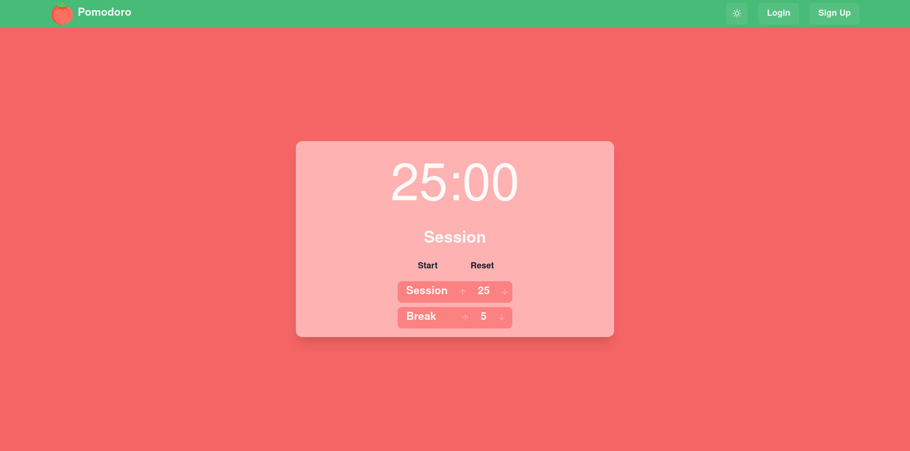

# Pomodomo

Frontend of pomodomo app. Click [here](https://github.com/khoaHyh/pomodomo-api) to view the backend repository.



## Local development   

#### `Setup`
```shell
$ git clone https://github.com/khoaHyh/pomodomo.git

$ cd pomodomo

$ npm i
```

#### `Run React app dev server`
```shell
$ npm run dev
```

## Tech/Framework 

  * React (Next.js)
  * ChakraUI
